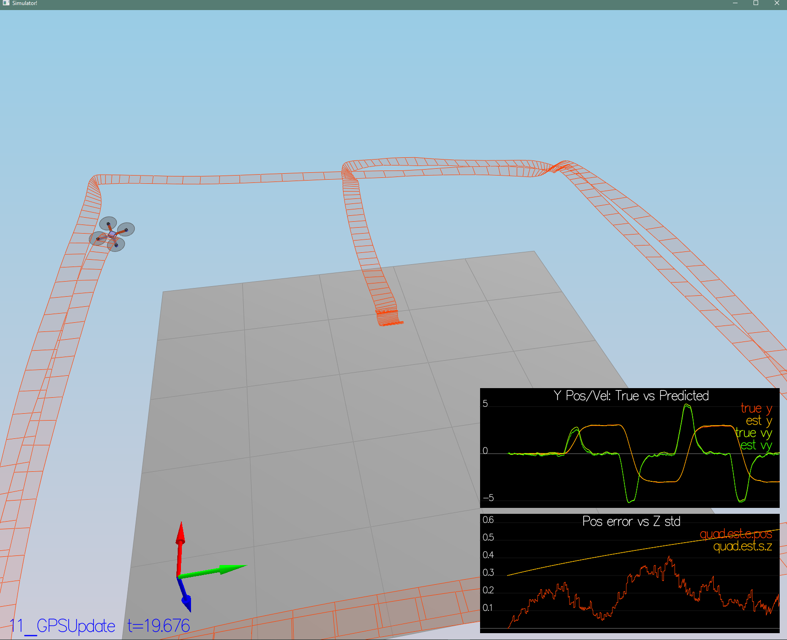

# FCND Estimation Project
In this project, you will be developing the estimation portion of the controller used in the CPP simulator.  By the end of the project, your simulated quad will be flying with your estimator and your custom controller (from the previous project)!

## The Tasks ##

### Step 1: Sensor Noise ###
For the controls project, the simulator was working with a perfect set of sensors, meaning none of the sensors had any noise.  The first step to adding additional realism to the problem, and developing an estimator, is adding noise to the quad's sensors.  For the first step, you will collect some simulated noisy sensor data and estimate the standard deviation of the quad's sensor.

In this simulation, the interest is to record some sensor data on a static quad, so you will not see the quad move.  You will see two plots at the bottom, one for GPS X position and one for The accelerometer's x measurement.  The dashed lines are a visualization of a single standard deviation from 0 for each signal. The standard deviations are initially set to arbitrary values (after processing the data in the next step, you will be adjusting these values).  If they were set correctly, we should see ~68% of the measurement points fall into the +/- 1 sigma bound.  When you run this scenario, the graphs you see will be recorded to the following csv files with headers: `config/log/Graph1.txt` (GPS X data) and `config/log/Graph2.txt` (Accelerometer X data).

Process the logged files to figure out the standard deviation of the the GPS X signal and the IMU Accelerometer X signal.

I used below python script
 
```python
import numpy as np

gps = np.loadtxt('log/Graph1.txt', delimiter=',', skiprows=1)[:, 1]
acc = np.loadtxt('log/Graph2.txt', delimiter=',', skiprows=1)[:, 1]
print(gps)

gps_std = np.std(gps)
acc_std = np.std(acc)

print('GPS std: ', gps_std)
print('Accelerometer std: ', acc_std)
```

Result was:
GPS std:  0.6483296846623903
Accelerometer std:  0.4856868560930763

Then I tuned these results to final values:
MeasuredStdDev_GPSPosXY = 0.7
MeasuredStdDev_AccelXY = 0.5

Your standard deviations should accurately capture the value of approximately 68% of the respective measurements.


### Step 2: Attitude Estimation ###
Now let's look at the first step to our state estimation: including information from our IMU.  In this step, you will be improving the complementary filter-type attitude filter with a better rate gyro attitude integration scheme.
For this simulation, the only sensor used is the IMU and noise levels are set to 0 (see `config/07_AttitudeEstimation.txt` for all the settings for this simulation).

In `QuadEstimatorEKF.cpp`, you will see the function `UpdateFromIMU()` contains a complementary filter-type attitude filter.  To reduce the errors in the estimated attitude (Euler Angles), implement a better rate gyro attitude integration scheme.  You should be able to reduce the attitude errors to get within 0.1 rad for each of the Euler angles, as shown in the screenshot below.

```cpp
Quaternion<float> attitude = Quaternion<float>::FromEuler123_RPY(rollEst, pitchEst, ekfState(6));
attitude.IntegrateBodyRate(gyro, dtIMU);

float predictedPitch = attitude.Pitch();
float predictedRoll = attitude.Roll();
ekfState(6) = attitude.Yaw();

// normalize yaw to -pi .. pi
if (ekfState(6) > F_PI) ekfState(6) -= 2.f*F_PI;
if (ekfState(6) < -F_PI) ekfState(6) += 2.f*F_PI;
```


### Step 3: Prediction Step ###
In this next step you will be implementing the prediction step of your filter.
This scenario is configured to use a perfect IMU (only an IMU). Due to the sensitivity of double-integration to attitude errors, we've made the accelerometer update very insignificant (`QuadEstimatorEKF.attitudeTau = 100`).
In `QuadEstimatorEKF.cpp`, implement the state prediction step in the `PredictState()` functon. If you do it correctly, when you run scenario `08_PredictState` you should see the estimator state track the actual state, with only reasonably slow drift.

```cpp
// rotation matrix Rbg
V3F accel_Rbg = attitude.Rotate_BtoI(accel);

// transition function g
predictedState(0) = curState(0) + curState(3) * dt;
predictedState(1) = curState(1) + curState(4) * dt;
predictedState(2) = curState(2) + curState(5) * dt;
predictedState(3) = curState(3) + accel_Rbg.x * dt;
predictedState(4) = curState(4) + accel_Rbg.y * dt;
predictedState(5) = curState(5) - CONST_GRAVITY * dt + accel_Rbg.z * dt;
// predictedState(6) - the yaw integral is already done in the IMU update. Be sure not to integrate it again here
```


In `QuadEstimatorEKF.cpp`, calculate the partial derivative of the body-to-global rotation matrix in the function `GetRbgPrime()`.  Once you have that function implement, implement the rest of the prediction step (predict the state covariance forward) in `Predict()`.

```cpp
float cosPitch = cos(pitch);
float sinYaw = sin(yaw);
float sinRoll = sin(roll);
float sinPitch = sin(pitch);
float cosYaw = cos(yaw);
float cosRoll = cos(roll);

RbgPrime(0, 0) = -cosPitch * sinYaw;
RbgPrime(0, 1) = -sinRoll * sinPitch * sinYaw - cosPitch * cosYaw;
RbgPrime(0, 2) = -cosRoll * sinPitch * sinYaw + sinRoll * cosYaw;
RbgPrime(1, 0) = cosPitch * cosYaw;
RbgPrime(1, 1) = sinRoll * sinPitch * cosYaw - cosRoll * sinYaw;
RbgPrime(1, 2) = cosRoll * sinPitch * cosYaw + sinRoll * sinYaw;
```
Run your covariance prediction and tune the `QPosXYStd` and the `QVelXYStd` process parameters in `QuadEstimatorEKF.txt` to try to capture the magnitude of the error you see. Note that as error grows our simplified model will not capture the real error dynamics (for example, specifically, coming from attitude errors), therefore  try to make it look reasonable only for a relatively short prediction period (the scenario is set for one second). Result seen below:
```
QPosXYStd = .03
QVelXYStd = .1
```


### Step 4: Magnetometer Update ###
In this step, you will be adding the information from the magnetometer to improve your filter's performance in estimating the vehicle's heading.

Run scenario `10_MagUpdate`.  This scenario uses a realistic IMU, but the magnetometer update hasn’t been implemented yet. As a result, you will notice that the estimate yaw is drifting away from the real value (and the estimated standard deviation is also increasing).  Note that in this case the plot is showing you the estimated yaw error (`quad.est.e.yaw`), which is drifting away from zero as the simulation runs.  You should also see the estimated standard deviation of that state (white boundary) is also increasing.

Tune the parameter `QYawStd` (`QuadEstimatorEKF.txt`) for the QuadEstimatorEKF so that it approximately captures the magnitude of the drift.
```
QYawStd = .08
```
Implement magnetometer update in the function `UpdateFromMag()`.  Once completed, you should see a resulting plot similar to this one:
```cpp
hPrime(0, 6) = 1;

zFromX(0) = ekfState(6);

float diff = magYaw - ekfState(6);
// normalize yaw to -pi .. pi
if (diff > F_PI) zFromX(0) += 2.f * F_PI;
if (diff < -F_PI) zFromX(0) -= 2.f * F_PI;
```


### Step 5: Closed Loop + GPS Update ###
Run scenario `11_GPSUpdate`.  At the moment this scenario is using both an ideal estimator and and ideal IMU.  Even with these ideal elements, watch the position and velocity errors (bottom right). As you see they are drifting away, since GPS update is not yet implemented.


2. Let's change to using your estimator by setting `Quad.UseIdealEstimator` to 0 in `config/11_GPSUpdate.txt`.  Rerun the scenario to get an idea of how well your estimator work with an ideal IMU.

3. Now repeat with realistic IMU by commenting out these lines in `config/11_GPSUpdate.txt`:
```
#SimIMU.AccelStd = 0,0,0
#SimIMU.GyroStd = 0,0,0
```


4. Tune the process noise model in `QuadEstimatorEKF.txt` to try to approximately capture the error you see with the estimated uncertainty (standard deviation) of the filter.

5. Implement the EKF GPS Update in the function `UpdateFromGPS()`.
```cpp
hPrime(0, 0) = 1;
hPrime(1, 1) = 1;
hPrime(2, 2) = 1;
hPrime(3, 3) = 1;
hPrime(4, 4) = 1;
hPrime(5, 5) = 1;

zFromX = hPrime * ekfState;
```

6. Now once again re-run the simulation.  Your objective is to complete the entire simulation cycle with estimated position error of < 1m (you’ll see a green box over the bottom graph if you succeed).  You may want to try experimenting with the GPS update parameters to try and get better performance.



### Step 6: Adding Your Controller ###
Up to this point, we have been working with a controller that has been relaxed to work with an estimated state instead of a real state.  So now, you will see how well your controller performs and de-tune your controller accordingly.

1. Replace `QuadController.cpp` with the controller you wrote in the last project.

2. Replace `QuadControlParams.txt` with the control parameters you came up with in the last project.

3. Run scenario `11_GPSUpdate`. If your controller crashes immediately do not panic. Flying from an estimated state (even with ideal sensors) is very different from flying with ideal pose. You may need to de-tune your controller. Decrease the position and velocity gains (we’ve seen about 30% detuning being effective) to stabilize it.  Your goal is to once again complete the entire simulation cycle with an estimated position error of < 1m.
```
# Position control gains
kpPosXY = 31
kpPosZ = 24
KiPosZ = 50

# Velocity control gains
kpVelXY = 14
kpVelZ = 9
```

